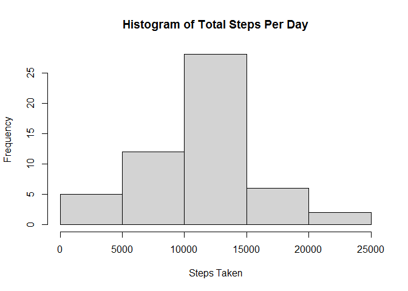
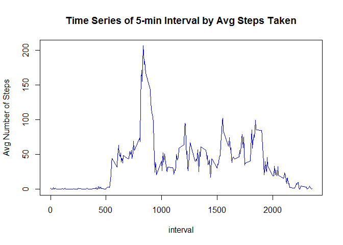
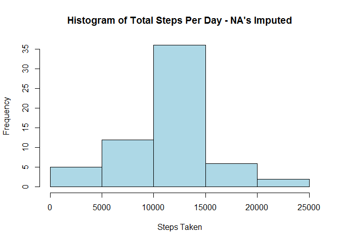
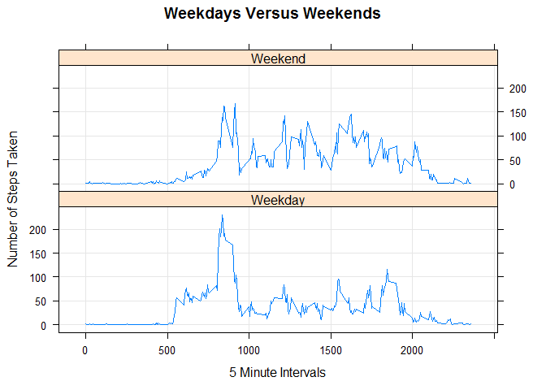

Reproducible Research Week 2 D\_Conway
================

Analysis of Personal Monitoring Device Data
-------------------------------------------

Before starting, the libraries need to be loaded.

``` r
library(markdown)
library(rmarkdown)
library(knitr)
library(ggplot2)
library(lattice)
library(dplyr)
```

Step 1: Read the data in and convert the date column from factor to date. (Show code)

``` r
data <- read.csv("activity.csv", stringsAsFactors = FALSE)
data$date<-as.Date(data$date, format='%Y-%m-%d')
```

Get the column names...

``` r
names(data)
```

    ## [1] "steps"    "date"     "interval"

The intervals can be converted to hours and minutes. So this next step is a transformation step to get the hour and 5 minute interval of the day. Print the tail just to make sure it looks right.

``` r
data<-mutate(data, hour=interval %/% 100, minute=interval %% 100)
tail(data)
```

    ##       steps       date interval hour minute
    ## 17563    NA 2012-11-30     2330   23     30
    ## 17564    NA 2012-11-30     2335   23     35
    ## 17565    NA 2012-11-30     2340   23     40
    ## 17566    NA 2012-11-30     2345   23     45
    ## 17567    NA 2012-11-30     2350   23     50
    ## 17568    NA 2012-11-30     2355   23     55

Step 2: Create a histogram of the total number of steps taken each day. Remove the NA's for this step.

``` r
for_histogram<-aggregate(steps~date, data=data, FUN=sum, na.rm=TRUE)

hist(for_histogram$steps,
     col="lightgray",
     border="black",
     xlab="Steps Taken",
     ylab="Frequency",
     main="Histogram of Total Steps Per Day")
```



Step 3: Show the mean and median values of the steps taken each day.

``` r
cat("Mean = ", format(round(mean(for_histogram$steps),1),nsmall=1))
```

    ## Mean =  10766.2

``` r
cat("Median = ", format(round(median(for_histogram$steps),1),nsmall=1))
```

    ## Median =  10765.0

Step 4: Now plot the time-series of the 5-minute interval (x-axis) and the average number of steps taken, averaged across all days (y-axis)

``` r
interval_agg<-aggregate(steps~interval, data, mean)
plot(interval_agg$interval, interval_agg$steps, type="l",
     col="blue",
     xlab="interval",
     ylab="Avg Number of Steps",
     main="Time Series of 5-min Interval by Avg Steps Taken")
```



Step 5: Determine the five minute interval that, on average, contains the maximum number of steps.

``` r
interval_to_use<-filter(interval_agg, steps==max(steps))
interval_to_use<-interval_to_use$interval
time_of_day<-head(filter(data, interval==interval_to_use),1)
cat("The time of day, on average, with the most steps taken is ", time_of_day$hour, ":", time_of_day$minute, ".")
```

    ## The time of day, on average, with the most steps taken is  8 : 35 .

Step 6: Show the code for imputing the missing values (NA's). First, calculate how many NA's there are.

``` r
sum(is.na(data$steps))
```

    ## [1] 2304

Now replace the NA values found within a given interval with the mean value for that interval.

``` r
copy_of_data<-data
for(i in 1:nrow(copy_of_data)) # step through the new data set
     if (is.na(copy_of_data$steps[i])) # see if the value of steps at position i is NA
          
      # if yes, inter this loop, otherwise move to next i
     {
          # find the mean for the interval in question by looking for the interval in
          # the aggregated dataset that contains means by interval
          temp<-interval_agg$steps[interval_agg$interval==copy_of_data$interval[i]]; 
          copy_of_data$steps[i]<-temp; # paste the mean found above into the dataset
     }

sum(is.na(data$steps)) # old data set, how many NA's
```

    ## [1] 2304

``` r
sum(is.na(copy_of_data$steps)) # new data set, how many NA's, should be zero.
```

    ## [1] 0

Step 7: Create a histogram of total steps per day by interval.

``` r
for_imputed_histogram<-aggregate(steps~date, data=copy_of_data, FUN=sum, na.rm=TRUE)

hist(for_imputed_histogram$steps,
     col="lightblue",
     border="black",
     xlab="Steps Taken",
     ylab="Frequency",
     main="Histogram of Total Steps Per Day - NA's Imputed")
```



Do these values differ from the estimates from the first part of the assignment? What is the impact of imputing missing data on the estimates of the total daily number of steps?

A: Yes, visually you can see that the frequency of the maximum steps goes from approximately 25 to approximately 35 for the 10,000 to 15,000 step block, which is a roughly 30% increase. The increase is less significant with the other blocks. So the impact is that it makes it look like it's more common then it actually is for a person to take the maximum number of steps in an interval.

Have the mean and median values changed since imputing the missing values?

``` r
cat("Mean = ", format(round(mean(for_imputed_histogram$steps),1),nsmall=1))
```

    ## Mean =  10766.2

``` r
cat("Median = ", format(round(median(for_imputed_histogram$steps),1),nsmall=1))
```

    ## Median =  10766.2

The answer is that the mean has not changed, but the median has, which would be expected if a large number of missing values were replaced by the means of each interval. It would bring the median closer to the mean.

Step 8: Create a panel plot comparing the average number of steps taken per 5-minute interval across weekdays and weekends.

First, split the data into weekdays and weekends.

``` r
copy_of_data$weekday<-as.factor(ifelse(weekdays(copy_of_data$date) %in% 
                    c("Saturday","Sunday"), "Weekend", "Weekday"))
```

Next, create the panel plot showing the separated weekday/weekend results.

``` r
aggregate_imputed<-aggregate(steps~interval + weekday, copy_of_data, mean)
xyplot(steps ~ interval | weekday, data=aggregate_imputed, type="l", grid=T, 
       layout=c(1,2), ylab="Number of Steps Taken", xlab="5 Minute Intervals", 
       main="Weekdays Versus Weekends")
```



It appears that overall activity is lower during the week than on the weekend.
